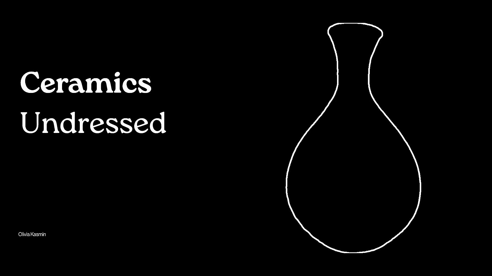
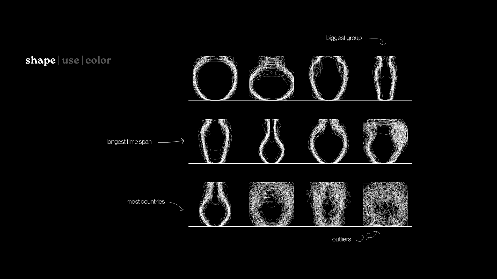
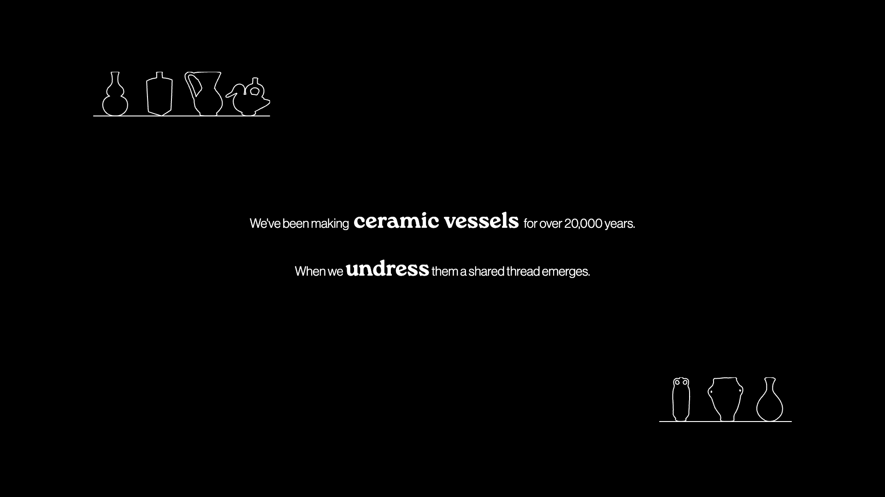
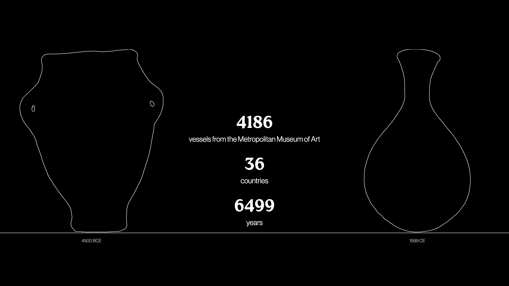
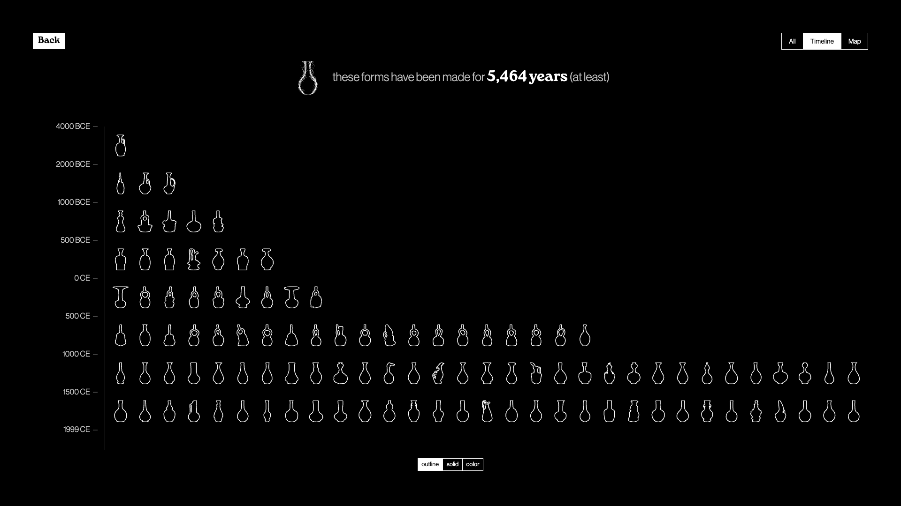
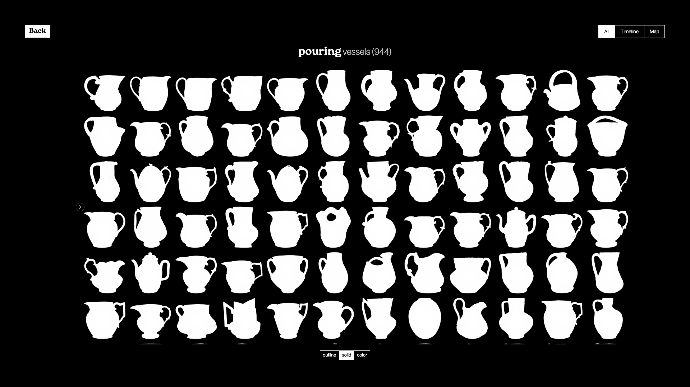
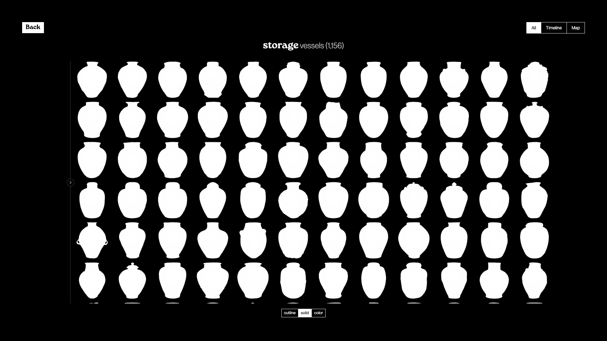
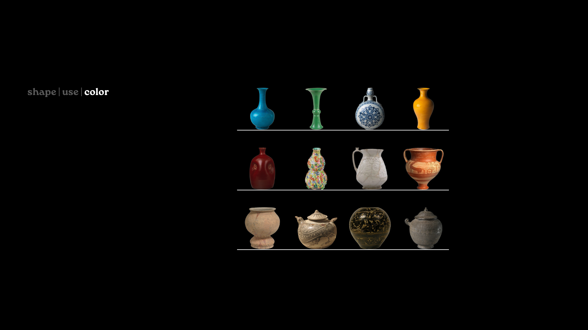
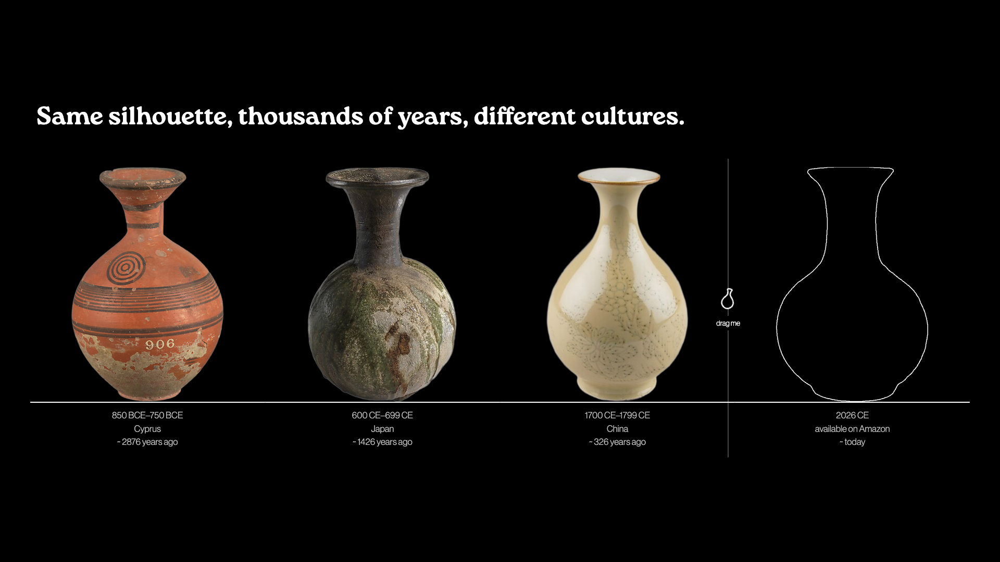

##### The practice of pottery shows us how connected we really are.

Olivia Kasmin, 2026
Parsons, The New School

---

### Project

https://okasmin-thesis-vessels.netlify.app/

---

### Abstract

Ceramic vessels are among the oldest and most constant traces of human making. In an age of constant progress, it is often our differences — not our similarities — that are celebrated. In this project, I show how ceramic vessels offer an opportunity to find a thread of connection to one another across oceans and political divides, and to our ancestors from thousands of years ago. When we undress ceramic vessels — ignoring surface decoration and focusing instead on form — similarities between objects become clear.

The technology of working clay into vessels to serve basic needs like cooking, drinking, and storage has existed for over 20,000 years. Though we’ve moved away from a hands-on connection with the materiality of clay — today, we interact mainly with mass-produced ceramics — we still share these same needs and use ceramics in our everyday lives.

By highlighting vessels whose forms resemble one another, I aim to emphasize that we resemble one another as well. It is not my intention to minimize the historical and artistic complexity of ceramics (or people), but rather to encourage an understanding of our connectedness, our similarity to other cultures, and our humanity through this common technology and canvas of expression and utility.

---

### Additional Images

